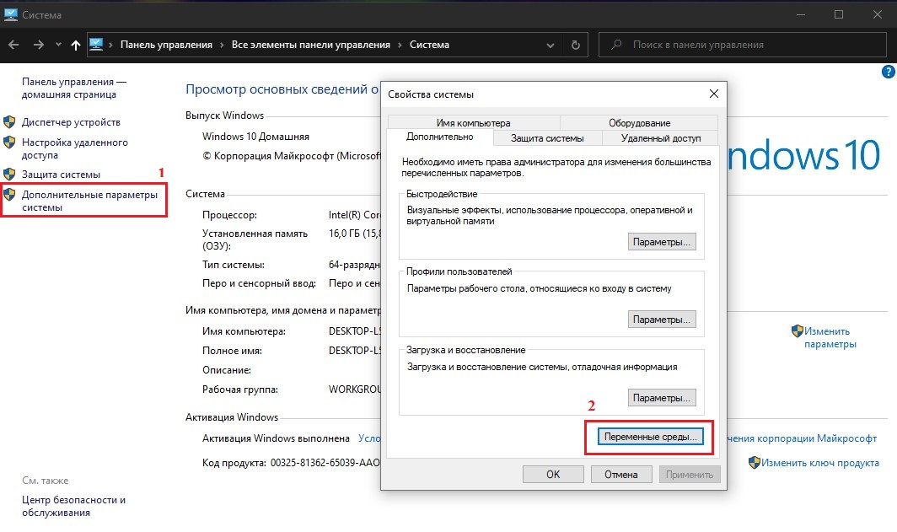
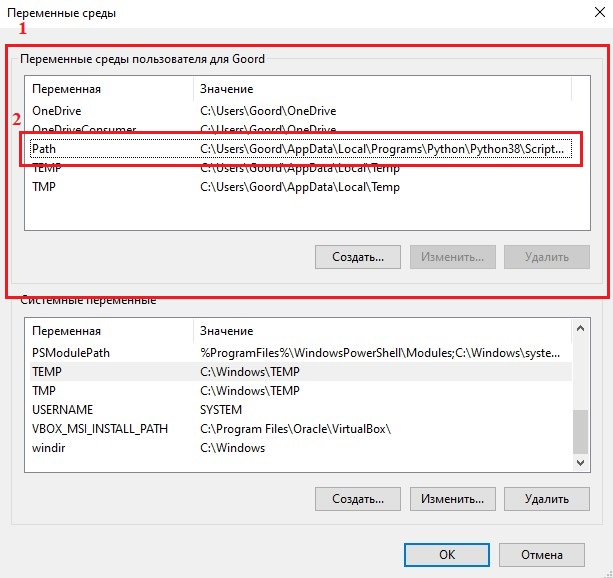
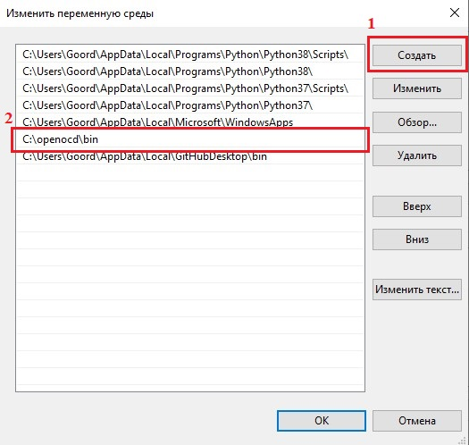

=========================================================
Настройка Segger Embedded Studio + OpenOCD на Windows 10 
=========================================================

Процесс настройки
------------

#. Загрузка SES и OpenOCD

#. Настройка OpenOCD

#. Настройка SES

#. Прошивка

1. **Скачать SES и OpenOCD**
------------------------

	Скачиваем Segger Embedded Studio `с официального сайта <https://www.segger.com/products/development-tools/embedded-studio/>`_

	Скачиваем OpenOCD `с неофициального сайта <https://gnutoolchains.com/arm-eabi/openocd/>`_

2. **Настройка OpenOCD**
---------------------------------------------------

 Скачаный архив нужно распаковать в корень диска С

.. code-block::
	  		
	 C:\openocd\bin
	 
	 C:\openocd\drivers
	
	 C:\openocd\share

Теперь нужно добавить исполняемый файл в список переменных среды Windows. Открываем "Свойства компьютера"

3. **Настройка SES**
----------------------------------------

 Процесс установки описывать нет смысла, поскольку нам нужно только IDE, драйвера для JLink нам не нужны. После установки желательно установить дополнительные пакеты.

 .. image:: .etc/img/ses_1.jpg
 
 .. image:: .etc/img/ses_1_1.jpg
 
 .. image:: .etc/img/ses_2.jpg

4. **Прошивка**
-----------------------

 Для примера предлагаю отркрыть любой проект из предложеных в SDK от Nordic. Нам нужно изменить настройки проекта
	
	Открываем настройки проекта:

 .. image:: .etc/img/ses_3.jpg
	
Меняем связующий мост:

 .. image:: .etc/img/ses_4.jpg

Выбор типа GDB сервера:
 
 .. image:: .etc/img/ses_5.jpg

Автостарт:

 .. image:: .etc/img/ses_6.jpg

Скрипт прошивки:

 .. image:: .etc/img/ses_7.jpg

.. code-block::
     
	 openocd -f interface/stlink.cfg -f target/nrf52.cfg

Если камень не хочет сохранять прошивку и, после ресета, запускает код, что был записан раньше - нужно очистить Flash. Достаточно открыть консоль и запустить скрипт 

.. code-block::
     
	 openocd -f interface/stlink.cfg -f target/nrf52.cfg -c "init; halt; nrf5 mass_erase"

Для прошивки достаточно запустить процесс отладки:

 .. image:: .etc/img/ses_8.jpg	